* Table of Contents
{:toc}

--------------------------------------------------------------------------------------------------------------------

## **Setting up, getting started**

Refer to the guide to set up the project in your computer using an Integrated Development Environment (IntelliJ is highly recommended)
 [_Setting up and getting started_](SettingUp.md).

--------------------------------------------------------------------------------------------------------------------

## **Design**
The different components and sub-components of _Common Cents_ and how they interact with each other.

### Architecture
The ***Architecture Diagram*** given above explains the high-level design of the App. Given below is a quick overview of each component.

:bulb: **Tip:** The `.puml` files used to create diagrams in this document can be found in the [diagrams](https://github.com/AY2021S1-CS2103T-T13-4/tp/tree/master/docs/diagrams/) folder. Refer to the [_PlantUML Tutorial_ at se-edu/guides](https://se-education.org/guides/tutorials/plantUml.html) to learn how to create and edit diagrams.

**`Main`** has two classes called [`Main`](https://github.com/AY2021S1-CS2103T-T13-4/tp/tree/master/src/main/java/seedu/cc/Main.java) and [`MainApp`](https://github.com/AY2021S1-CS2103T-T13-4/tp/tree/master/src/main/java/seedu/cc/MainApp.java). It is responsible for,
* At app launch: Initializes the components in the correct sequence, and connects them up with each other.
* At shut down: Shuts down the components and invokes cleanup methods where necessary.

[**`Commons`**](#common-classes) represents a collection of classes used by multiple other components.

The rest of the App consists of four components.

* [**`UI`**](#ui-component): The UI of the App.
* [**`Logic`**](#logic-component): The command executor.
* [**`Model`**](#model-component): Holds the data of the App in memory.
* [**`Storage`**](#storage-component): Reads data from, and writes data to, the hard disk.

Each of the four components,

* defines its *API* in an `interface` with the same name as the Component.
* exposes its functionality using a concrete `{Component Name}Manager` class (which implements the corresponding API `interface` mentioned in the previous point.

For example, the `Logic` component (see the class diagram given below) defines its API in the `Logic.java` interface and exposes its functionality using the `LogicManager.java` class which implements the `Logic` interface.

**How the architecture components interact with each other**

The *Sequence Diagram* below shows how the components interact with each other for the scenario where the user issues the command `delete 1`.

The sections below give more details of each component.

### UI component

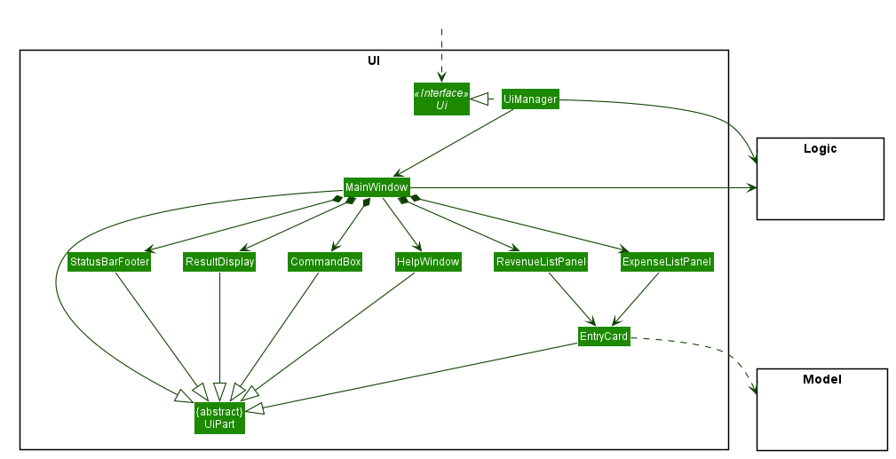

**API** :
The UI consists of a `MainWindow` that is made up of parts e.g.`CommandBox`, `ResultDisplay`, `AccountListPanel`, `StatusBarFooter` etc. All these, including the `MainWindow`, inherit from the abstract `UiPart` class.

The `UI` component uses JavaFx UI framework. The layout of these UI parts are defined in matching `.fxml` files that are in the `src/main/resources/view` folder. For example, the layout of the [`MainWindow`](https://github.com/AY2021S1-CS2103T-T13-4/tp/tree/master/src/main/java/seedu/address/ui/MainWindow.java) is specified in [`MainWindow.fxml`](https://github.com/AY2021S1-CS2103T-T13-4/tp/tree/master/src/main/resources/view/MainWindow.fxml)

[`Ui.java`](https://github.com/AY2021S1-CS2103T-T13-4/tp/tree/master/src/main/java/seedu/cc/ui/Ui.java)

The `UI` component,

* Executes user commands using the `Logic` component.
* Listens for changes to `Model` data so that the UI can be updated with the modified data.

### Logic component
The Logic component parses and executes the commands.  

**API** :
[`Logic.java`](https://github.com/AY2021S1-CS2103T-T13-4/tp/tree/master/src/main/java/seedu/cc/logic/Logic.java)

* `Logic` uses the `CommonCentsParser` class to parse the user command.
* This results in a `Command` object which is executed by the `LogicManager`.
* The command execution can either affect the `ActiveAccount` which in turn affects the `Model` (e.g. adding an expense), 
or affect the `Model` directly (e.g. adding an account).
* Based on the changes the command execution made, the `CommandResultFactory` generates a `CommandResult` object which encapsulates
the result of the command execution and is passed back to the `Ui`,
* In addition, the `CommandResult` object can also instruct the `Ui` to perform certain actions, such as displaying help to the user.

Given below is the Sequence Diagram for interactions within the `Logic` component for the `execute("deleteacc 1")` API call.

:information_source: **Note:** The lifeline for `DeleteAccountCommandParser`, `DeleteAccountCommand` and `CommandResultFactory` should end at the destroy marker (X) but due to a limitation of PlantUML, their lifeline reach the end of diagram.

### Model component
The model component stores the relevant data for _Common Cents_. 

**API** : [`Model.java`](https://github.com/AY2021S1-CS2103T-T13-4/tp/tree/master/src/main/java/seedu/cc/model/Model.java)

The `Model`,

* stores a `UserPref` object that represents the user’s preferences.
* stores the CommonCents data.
* stores an unmodifiable list of Accounts.
* does not depend on any of the other three components.

The `Account`,

:information_source: **Note:** An alternative (arguably, a more OOP) model is given below. It has a `Tag` list in the `CommonCents`, which `Entry` references. This allows `CommonCents` to only require one `Tag` object per unique `Tag`, instead of each `Entry` needing their own `Tag` object. 
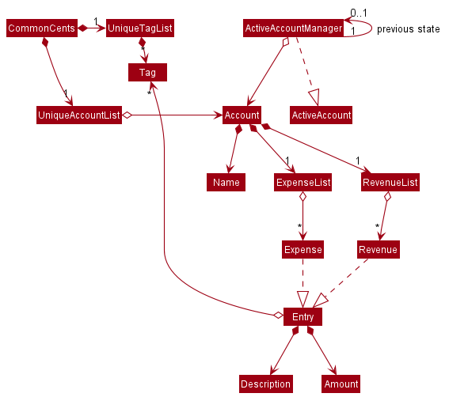

### Storage component
The Storage component deals with save and load user data.

**API** : [`Storage.java`](https://github.com/AY2021S1-CS2103T-T13-4/tp/tree/master/src/main/java/seedu/cc/storage/Storage.java)

The `Storage` component,
* can save `UserPref` objects in json format and read it back.
* can save the CommonCents data in json format and read it back.

### Common classes

Classes used by multiple components are in the `seedu.cc.commons` package.

--------------------------------------------------------------------------------------------------------------------

## **Implementation**

This section describes some noteworthy details on how certain features are implemented.

## Delete feature
This feature allows the user to delete previously added entries.

#### Implementation

The Find entries feature is facilitated by `DeleteCommand`. It extends `Command` and 
is identified by `CommonCentsParser` and `DeleteCommandParser`. The DeleteCommand interacts 
with `Account` and the interactions are managed by `ActiveAccount`. As such, it implements the following
operations: 

* `Account#deleteExpense(Expense expense)` — Executes delete logic for specified _Expense_ entry.
* `Account#deleteRevenue(Revenue revenue)` — Executes delete logic for specified _Revenue_ entry.

Given below is an example usage scenario and how the delete mechanism behaves at each step.

* Step 1: The user inputs the delete command to specify which entry to delete in the specified category
of `ActiveAccount`. `CommandParser` identifies the command word `delete` and calls `DeleteCommandParser#parse(String args)`
to parse the input into a valid `DeleteCommand`.

* Step 2: `DeleteCommand` starts to be executed. In the execution:

### Undo feature
This feature allows the user to undo their previous entry-level commands.

#### Implementation

The undo mechanism is facilitated by `ActiveAccountManager` which implements the interface `ActiveAccount`. The `ActiveAccountManager` 
stores its previous state as an `ActiveAccount` attribute when a entry command is executed. On the other hand, the `ActiveAccount` sets the previous 
state as its current state when the undo commands is executed. As such, it implements the following operations:

* `ActiveAccountManager#setPreviousState()` — Saves a copy of the current `ActiveAccountManager` state as an attribute in `ActiveAccountManager`.
* `ActiveAccountManager#returnToPreviousState()` — Restores the previous `ActiveAccountManager` state from its attribute.

These operations are exposed in the `ActiveAccount` interface as `ActiveAccount#setPreviousState()` and `ActiveAccount#returnToPreviousState()` respectively.

Given below is an example usage scenario and how the undo mechanism behaves at each step.

Prelude. When the user first runs _Common Cents_, `ActiveAccountManager` does not store any previous states as shown in the diagram below.

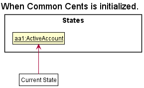

Step 1. The user executes `delete 5 c/expense` command to delete the 5th expense in the expense list in the Account in `ActiveAccountManager`. The `delete` command calls `ActiveAccountManager#setPreviousState()` initially, 
causing a copy of the `ActiveAccountManager` state before the `delete 5 c/expense` command executes to be saved as an attribute. After this, the `delete 5 c/expense` command executes and the
model is updated according to the modified account in ActiveAccount.

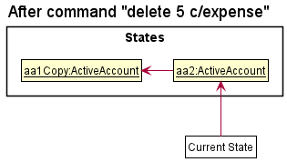

Step 3. The user executes `add c/expense …​` to add a new expense. The `add` command calls `ActiveAccountManager#setPreviousState()` initially, 
causing a copy of the `ActiveAccountManager` state before the command executes to be saved as an attribute. After this, the `add c/expense …​` command executes and the
model is updated according to the modified account in ActiveAccount.

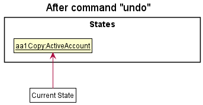

:information_source: **Note:** If a command fails its execution, it will not call `ActiveAccountManager#setPreviousState()`, so the state will not be saved into its attribute.

Step 4. The user now decides that adding the expense was a mistake, and decides to undo that action by executing the `undo` command. The `undo` command will call `ActiveAccountManager#returnToPreviousState()`, 
which will set data of the previous state attribute to the current `ActiveAccountManager`. 

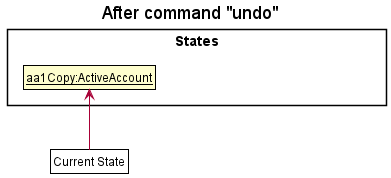

:information_source: **Note:** If the `ActiveAccountManager` does not have a previous state 
(i.e The `previousState` attribute in `ActiveAccountManager` is empty) then there are no previous `ActiveAccountManager` states to restore. 
The `undo` command uses `Model#hasNoPreviousState()` to check if this is the case. If so, it will return an error to the user rather
than attempting to perform the undo.

The following sequence diagram shows how the undo operation works:

:information_source: **Note:**:

 * The lifeline for `UndoCommand` should end at the destroy marker (X) but due to a limitation of PlantUML, the lifeline reaches the end of diagram.
 * Some of the interactions with the utility classes, such as `CommandResult`, `CommandResultFactory` and `Storage` are left out of the sequence diagram as their roles are not significant in the execution
   of the undo command. 
   

The following activity diagram summarizes what happens when a user executes a new command:

:information_source: **Note:** `ActiveAccountManager#setPreviousState()` is only called in `add`, `delete`, `edit`, and `clear` commands. 
Hence, the `undo` command only works on the previously stated commands which interacts with entries.

#### Design consideration
Explanation why a certain design is chosen.

##### Aspect: How undo executes

* **Alternative 1 (current choice):** Saves the entire ActiveAccount.
  * Pros: Easy to implement.
  * Cons: 
    * May have performance issues in terms of memory usage. 
    * Only allow undo command to work for commands dealing with entries.
  
* **Alternative 2:** Saves the entire Model and ActiveAccount 
  * Pros: More commands can be undone, for instance commands dealing with accounts.
  * Cons: 
    * May have performance issues in terms of memory usage. 
    * We must ensure that the implementation avoids unnecessary changes to Model or ActiveAccount that can result in errors.

* **Alternative 3:** Individual command knows how to undo/redo by
  itself.
  * Pros: Will use less memory (e.g. for `delete`, just save the entry being deleted).
  * Cons: We must ensure that the implementation of each individual command are correct.

### Edit account feature
This feature allows the user to edit the information of a specific existing entry.

#### Implementation
The proposed edit account mechanism is facilitated by `EditAccountCommand`. It extends `Command` and is identified by
`CommonCentsParser` and `EditAccountCommandParser`. The `EditAccountCommand` interacts with `Account` and the interaction
is managed by `ActiveAccount` as well as the `Model`. As such, it implements the following operation:

* `Account#setName(Name editedName)` — Sets the name of the account

This operation is exposed in the `ActiveAccount` interface as `ActiveAccount#setName()`.

Given below is an example usage scenario and how the edit account mechanism behaves at each step.

* Step 1: The user inputs the edit command to edit the current account in `ActiveAccount`. `CommonCentsParser` identifies
the command word and calls `EditCommandParser#parse(String args)` to parse the input into a valid `EditAccountCommand`

* Step 2: `EditAccountCommand` starts to be executed. In the execution, the current account, namely `previousAccount`
in `ActiveAccount` is retrieved.

* Step 3: `ActiveAccount#setName(Name editedName)` is called with the edited name to replace the name of the current
account in `ActiveAccount`.

* Step 4: The updated account, namely `newAccount`, in `ActiveAccount` is retrieved.

* Step 5: `Model#setAccount(Account target, Account editedAccount)` is called with `previousAccount` as `target`, and
`newAccount` as `editedAccount`. This is to replace the to-be-edited account in the Model with the edited account.

The following sequence diagram shows how an edit account operation works:

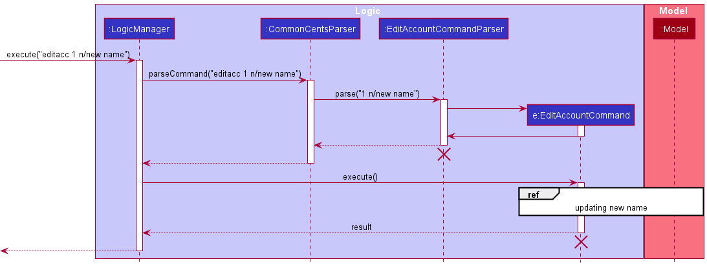

:information_source: **Note:**

* The lifeline for `EditAccountCommandParser` and `EditAccountCommand` should end at the destroy marker (X) but due to a limitation of PlantUML, their lifeline reach the end of diagram.
* Some of the interactions with the utility classes, such as `CommandResult`, `CommandResultFactory` and `Storage` are left out of the sequence diagram as their roles are not significant in the execution
of the edit account command. 

The following activity diagram summarizes what happens when a user executes a new command:

#### Design consideration
Explanation why a certain design is chosen.

##### Aspect: How edit account executes

* **Alternative 1 (current choice):** Accounts can only be edited if they are active.
  * Pros: Easy to implement.
  * Cons: Less flexibility for user.

* **Alternative 2:** Accounts can be edited by retrieving them from the account list with an index input.
  * Pros: More flexibility for user.
  * Cons: It is difficult to implement and manage because we need to consider whether the account to be edited
  is active and add extra measures for that case. As such, we chose alternative one since it is a more elegant
  solution.
  
##### Aspect: Mutability of account
* **Choice:** Allowing name attribute of Account to be mutated by EditCommand.
  * Rationale: Initially, we implemented the name attribute of Account to be immutable. However, we realize that it
  is difficult to edit the name of the account if it is immutable. Hence, to overcome this obstacle, we decided
  to make the name attribute mutable.
  * Implications: Extra precaution needs to be implemented, for instance creating copies of account in methods that interacts
  with the accounts to prevent unnecessary changes to accounts in account list. Hence, it resulted in more defensive coding 
  which resulted in more lines of code.

### Find entries feature 
*(Written by Le Hue Man)*
This feature allows the user to find specific existing entries using a given keyword.
  
#### Implementation

The Find entries feature is facilitated by `FindCommand`. It extends `Command` and 
is identified by `CommonCentsParser` and `FindCommandParser`. The FindCommand interacts 
with `Account` and the interactions are managed by `ActiveAccount`. As such, it implements the following
operations: 
* `Account#updateFilteredExpenseList(Predicate<Expense> predicate)` — Updates the expense 
list that has the given keywords as predicate.
* `Account#updateFilteredRevenueList(Predicate<Revenue> predicate)` — Updates the revenue 
list that has the given keywords as predicate. 

Given below is an example usage scenario and how the find entries mechanism behaves 
at each step.

* Step 1. The user inputs the find command to find the entries that have the occurrences of 
a list of specified keywords in the entries of `ActiveAccount`. `CommandParser` identifies the command word `find`
and calls `FindCommandParser#parse(String args)` to parse the input into a valid `FindCommand`.

* Step 2. `FindCommand` starts to be executed. In the execution, 
    * If there is a predicate for keywords in the expense list of `ActiveAccount`, the expense list is updated. 
    `ActiveAccount#updateFilteredExpenseList()` is called to update the current expense list with expenses 
    with descriptions matching the keywords. 
    * If there is a predicate for keywords in the revenue list of `ActiveAccount`, the revenue list is updated. 
    `ActiveAccount#updateFilteredExpenseList()` is called to update the current revenue list with revenues
    with descriptions matching the keywords.

The following sequence diagram shows how a find entry operation works:

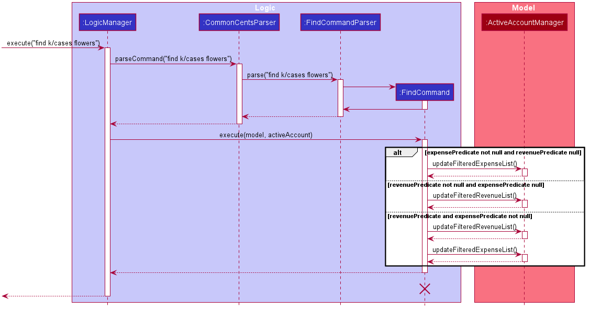

:information_source: **Note:** Some of the interactions with the utility classes,
such as `CommandResult` and `Storage` are left out of the sequence diagram as their roles are not significant in the execution
of the find entries command.

The following activity diagram summarizes what happens when a user executes a new command:

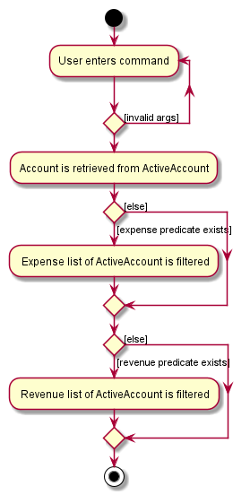

#### Design consideration
Explanation why a certain design is chosen.

##### Aspect: How find entries command is parsed
* **Choice:** User needs to use prefix "k/" to before the keywords.
    * Pros: 
        * Easy to implement as the arguments can be tokenized in the event of inputs with multiple arguments.
        * Able to handle multiple arguments as input for Category (with prefix "c/") is optional.
    * Cons: Less convenience for the user. 

### Calculate net profits feature

#### Implementation
The calculate net profits mechanism is facilitated by `GetProfitCommand`. It extends `Command` and is identified by `CommonCentsParser`. The `GetProfitCommand` interacts with `Account` and the interaction is managed by `ActiveAccount`. As such, it implements the following operations:   

* `Account#getProfits()` — gets the net profit from the total expenses and revenues in the account
* `Account#getTotalExpenses()` — gets the total sum of all the expenses in the account
* `Account#getTotalRevenue()` — gets the total sum of all the revenues in the account

The operation is exposed in the `ActiveAccount` interface as `ActiveAccount#getProfits()`.

Given below is an example usage scenario and how the calculate net profits mechanism behaves at each step.

* Step 1. The user inputs the profit command to calculate the net profits in the current account in ActiveAccount. `CommonCentsParser` identifies the command word and calls a valid `GetProfitCommand`.

* Step 2. `GetProfitCommand` starts to be executed. In the execution, `ActiveAccount#getProfits()` is called to calculate the net profits. 
    * `Account#getTotalExpense()` and `Account#getTotalRevenue()` are called in `ActiveAccount#getProfits` to get the total expenses and total revenues. The net profit is then calculated by subtracting the difference.

The following sequence diagram shows how a calculate net profits operation works: 

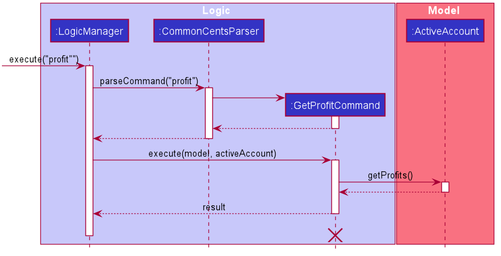

:information_source: **Note:**:

 * The lifeline for `GetProfitCommand` should end at the destroy marker (X) but due to a limitation of PlantUML, the lifeline reaches the end of diagram.
 * Some of the interactions with the utility classes, such as `CommandResult`, `CommandResultFactory` and `Storage` are left out of the sequence diagram as their roles are not significant in the execution
   of the get profit command. 
   

The following activity diagram summarizes what happens when a user executes a new command:

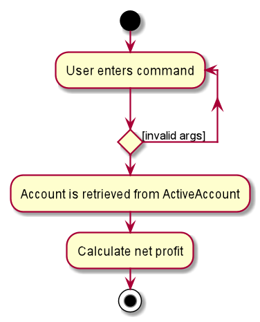

#### Design consideration
Explanation why a certain design is chosen.

##### Aspect: How calculate net profits executes:
* Choice: Calculates the net profits by retrieving the expense and revenue lists from the account. 
    * Pros: Easy to implement 

### \[Proposed\] Data archiving

_{Explain here how the data archiving feature will be implemented}

--------------------------------------------------------------------------------------------------------------------

## **Documentation, logging, testing, configuration, dev-ops**
This section includes the guides for developers to reference.
* [Documentation guide](Documentation.md)
* [Testing guide](Testing.md)
* [Logging guide](Logging.md)
* [Configuration guide](Configuration.md)
* [DevOps guide](DevOps.md)

--------------------------------------------------------------------------------------------------------------------

## **Appendix: Requirements**
This includes the different functional as well as non-functional requirements of _Common Cents_. 
### Product scope
The problems _Common Cents_ aims to tackle.

**Target user profile:**

* Has a need to manage a significant number of business accounts, each with a significant number of financial entries
* Prefers desktop apps over other types
* Can type fast
* Prefers typing to mouse interactions
* Is reasonably comfortable using CLI apps

**Value proposition**: 
* Can manage financial entries faster than a typical mouse/GUI driven app
* Provides a simple UI for business owners to see all the desired information easily
* Provides an aesthetic UI which is pleasant to the eye

### User stories
This section describes the features of _Common Cents_ from an end-user perspective. 

 

:information_source: **Note:** 

Priorities are represented by the number of `*` 
* High (must have) - `* * *` 
* Medium (nice to have) - `* *` 
* Low (unlikely to have) - `*`
 

| Priority | As a …​                                    | I want to …​                     | So that I can…​                                                        |
| -------- | ------------------------------------------ | ------------------------------ | ---------------------------------------------------------------------- |
| `* * *` | user | be able to exit the app |  |
| `* * *` | user | be able to add my expense/revenues entries to the userboard |  |
| `* * *` | user | be able to delete my expense/revenue entries from the userboard |  |
| `* * *` | user | view my expenditure by category |  |
| `* * *` | new user | be able to view a help FAQ on the functionality of the program | navigate through the different aspects of it |
| `* * *` | user | be able to save my tasks and load them when the app is re-opened |                                    |
| `* * *` | user with many side businesses | keep my accounts and expenses separate | understand where my inflow and outflow of finances come from |
| `* * *` | user | have my expenses/revenues be calculated on demand |  |
| `* * *` | clumsy user | be able to edit my expenses/revenues | fix wrongly keyed-in information |
| `* * *` | user | be able to find specific expenses/revenues| check for its specific information |
| `* * *` | user | be able to view my net profits on the userboard |  |
| `* * *` | clumsy user | be able to undo my commands | to reverse unwanted/wrong commands |
| `* * *` | fast typist | be able to maximize my typing speed |  |
| `* * *` | user | have commands that are short but as intuitive as possible |  |
| `* *` | user who as an eye for aesthetics | have an app that is elegant and visually appealing | be motivated to use the app more |
| `* *` | user | have an app that is intuitive and easy to use | easily navigate through it |
| `* *` | user with limited time | have an app that is user friendly and efficient | save time |
| `* *` | user | be able to use the app in dark mode | protect my eyesight |
| `* *` | user | have incentive every time I use the app (maybe a little game or puzzle) | be motivated to use it to track my spending more |
| `* *` | user | have an app that caters specifically to different types of accounts (business or personal) | efficiently manage my expenses and revenues | 
| `*` | user | be given tips and tricks on how to use the app to plan my spending | save my money effectively |

*{More to be added}*

### Use cases 
This captures different scenarios of how a user will perform tasks while using _Common Cents_. 
(Update the number once all the use cases are done) (Comment)

(For all use cases below, the **System** is the `CommonCents` and the **Actor** is the `user`, unless specified otherwise)

**Use Case: UC01 - Adding an expense**

**MSS**

1.  User requests to add an expense
2.  Common Cents adds the expense to expense list and displays success message.

    Use case ends.

**Extensions**

* 1a. The given command input is in invalid format.

    * 1a1. Common Cents shows an error message.

      Use case resumes at step 1.

**Use Case: UC02 - Adding a revenue**

**MSS**

1.  User requests to add revenue.
2.  Common Cents adds revenue to revenue list and displays success message.

    Use case ends.

**Extensions**

* 1a. The given command input is in invalid format.

    * 1a1. Common Cents shows an error message.

      Use case resumes at step 1.

**Use Case: UC03 - Deleting an expense**

**MSS**

1.  User requests to delete an expense.
2.  Common cents deletes the expense.

    Use case ends.

**Extensions**

* 1a. The given command input is in invalid format.

    * 1a1. Common cents shows an error message.

      Use case resumes at step 1.

**Use Case: UC04 - Deleting a revenue**

**MSS**

1.  User requests to delete an revenue.
2.  Common Cents removes the revenue from the revenue list and displays success message.

    Use case ends.

**Extensions**

* 1a. The given command input is in invalid format.

    * 1a1. Common cents shows an error message.

      Use case resumes at step 1.

**Use Case: UC05 - Editing an expense**

**MSS**

1.  User requests to edit an expense entry.
2.  Common Cents edits the supplied parameters the expense entry in the expense list and displays success message.

    Use case ends.

**Extensions**

* 1a. The given command input is in invalid format.

    * 1a1. Common cents shows an error message.

      Use case resumes at step 1.

**Use Case: UC06 - Editing a revenue**

**MSS**

1.  User requests to edit a revenue entry.
2.  Common Cents edits the supplied parameters the revenue entry in the revenue list and displays success message.

    Use case ends.

**Extensions**

* 1a. The given command input is in invalid format.

    * 1a1. Common cents shows an error message.

      Use case resumes at step 1.

**Use Case: UC07 - Clearing all expense entries**

**MSS**

1. User requests to clear all entries in expense list.
2. Common Cents clears all expense entries in the expense list and displays success message.

    Use case ends.

**Extensions**

* 1a. The given command input is in invalid format.

    * 1a1. Common cents shows an error message.

      Use case resumes at step 1.    

**Use Case: UC08 - Clearing all revenue entries**

**MSS**

1. User requests to clear all entries in revenue list.
2. Common Cents clears all expense entries in the revenue list and displays success message.

    Use case ends.

**Extensions**

* 1a. The given command input is in invalid format.

    * 1a1. Common cents shows an error message.

      Use case resumes at step 1.    

**Use Case: UC09 - Undoing an add command**

**MSS**

1.  User requests <u> add an expense (UC01)</u>.
2.  User requests to undo command.
3.  Common Cents returns to the state prior to the add command and displays success message.

**Use Case: UC10 - Undoing a delete command**

**MSS**

1.  User requests <u> delete an expense (UC03)</u>.
2.  User requests to undo command.
3.  Common Cents returns to the state prior to the delete command and displays success message.

**Use Case: UC11 - Undoing an edit command**

**MSS**

1.  User requests <u> edit an expense (UC05)</u>.
2.  User requests to undo command.
3.  Common Cents returns to the state prior to the edit command and displays success message.

**Use Case: UC12 - Undoing a clear all expenses command**

**MSS**

1.  User requests to <u> clear all expenses (UC07)</u>.
2.  User requests to undo command.
3.  Common Cents returns to the state prior to the clear expenses command and displays success message.

**Use Case: UC13 - Undoing a clear all revenues command**

**MSS**

1.  User requests to <u> clear all revenues (UC08)</u>.
2.  User requests to undo command.
3.  Common Cents returns to the state prior to the clear revenues command and displays success message.

**Use Case: UC14 - Finding specific expenses**

**MSS**

1. User requests to find some specific expenses by giving keywords.
2. Common Cents filters the expense list to show the required expenses and displays success message.

    Use case ends.

**Extensions**

* 1a. The given command input is in invalid format.

    * 1a1. Common Cents shows an error message.

      Use case resumes at step 1.
      
* 1b. User does not input a keyword or a list of keywords.

    * 1b1. Common Cents shows an error message.

      Use case resumes at step 1.
      
* 1c. User inputs a keyword or a list of keywords that do not exist in any of the expenses' description.

    * 1c1. Common Cents shows an empty expense list and displays a message to inform user that no expense is found.

      Use case resumes at step 1.

**Use Case: UC15 - Finding specific revenues**

**MSS**

1. User requests to find some specific revenues by giving keywords.
2. Common Cents filters the revenue list to show the required revenues and displays success message.

    Use case ends.

**Extensions**

* 1a. The given command input is in invalid format.

    * 1a1. Common Cents shows an error message.

      Use case resumes at step 1.
      
* 1b. User does not input a keyword or a list of keywords.

    * 1b1. Common Cents shows an error message.

      Use case resumes at step 1.
      
* 1c. User inputs a keyword or a list of keywords that do not exist in any of the revenues' description.

    * 1c1. Common Cents shows an empty revenue list and displays a message to inform user that no revenue is found.

      Use case resumes at step 1.

**Use Case: UC16 - Finding specific entries (either expenses or revenues)**

**MSS**

1. User requests to find some specific entries by giving keywords.
2. Common Cents filters both expense and revenue lists to show the required entries and displays success message.

    Use case ends. 

**Extensions**

* 1a. The given command input is in invalid format.

    * 1a1. Common Cents shows an error message.

      Use case resumes at step 1.
      
* 1b. User does not input a keyword or a list of keywords.

    * 1b1. Common Cents shows an error message.

      Use case resumes at step 1.
      
* 1c. User inputs a keyword or a list of keywords that do not exist in any of the entries' description.

    * 1c1. Common Cents shows an empty expense and revenue lists and displays a message to inform user that no expense is found.

      Use case resumes at step 1.

**Use Case: UC17 - Calculate total profits**

**MSS**

1. User requests to calculate profits at current state.
2. Common Cents calculates profits by finding the difference between revenues and expense and returns profit amount as a message.

    Use case ends.

**Use Case: UC18 - List all entries**

**MSS**

1. User requests to find some specific entries (UC16).
2. User requests to list all entries.
3. Commmon Cents displays all entries again before find command was used.

    Use case ends.

**Use Case: UC19 - Adding an account**

**MSS**

1. User request to add a new account.
2. Common Cents adds account to account list and displays success message

    Use case ends.

**Extensions**

* 1a. The given command input is in invalid format.

    * 1a1. Common Cents shows an error message.

      Use case resumes at step 1.
      
* 1b. The account to be added has the same name as an existing account in Common Cents.

    * 1b1. Common Cents shows an error message.

      Use case resumes at step 1.

**Use Case: UC20 - Adding an account**

**MSS**

1. User request to add a new account.
2. Common Cents adds account to account list and displays success message

    Use case ends.

**Extensions**

* 1a. The given command input is in invalid format.

    * 1a1. Common Cents shows an error message.

      Use case resumes at step 1.
      
* 1b. The account to be added has the same name as an existing account in Common Cents.

    * 1b1. Common Cents shows an error message.

      Use case resumes at step 1.

**Use Case: UC21 - Listing accounts**

**MSS**

1.  User requests to list all the accounts
2.  Common Cents displays the name of the accounts and their indices.

    Use case ends.

**Use Case: UC22 - Delete an account**

**MSS**

1.  User requests <u> list all the account (UC)</u>.
2.  User requests to delete account.
3.  Common Cents removes the account from the account list and displays success message.

    Use case ends.

**Extensions**

* 1a. The given command input is in invalid format.

    * 1a1. Common cCnts shows an error message.

      Use case resumes at step 2.

* 1b. Common Cents only has an account.

    * 1b1. Common Cents shows an error message.
    
      Use case resumes at step 2.
    
* 1c. User is currently managing the account to be deleted.
    * 1c1. Common Cents shows an error message.
          
      Use case resumes at step 2.

**Use Case: UC23 - Editing the account's name**

**MSS**

1.  User requests <u> list all the account (UC)</u>.
2.  User requests to edit the account's name.
3.  Common Cents edits the account name displays success message.

    Use case ends.

**Extensions**

* 2a. The given command input is in invalid format.

    * 2a1. Common Cents shows an error message.

      Use case resumes at step 2.
      
* 2b. The new account name is the same as a name of an existing account.

    * 2b1. Common Cents shows an error message.
    
      Use case resumes at step 2.
      
* 2c. The new account name is the same as the current name of the account.

    * 2c1. Common Cents shows an error message.
    
      Use case resumes at step 2.

**Use Case: UC24 - Switching to an account**

**MSS**

1.  User requests <u> list all the account (UC) </u>.
2.  User requests to switch to another account.
3.  Common Cents switches to another account and displays success message.

    Use case ends.

**Extensions**

* 2a. The given command input is in invalid format.

    * 2a1. Common Cents shows an error message.

      Use case resumes at step 2.
      
* 2b. The user is already on the account to be switched.

    * 2b1. Common Cents shows an error message.
    
      Use case resumes at step 2.

**Use Case: UC25 - Exiting app**
    
**MSS**

1.  User requests to exit
2.  Common Cents responds with exit message and closes.

    Use case ends.

      
*{More to be added}*

### Non-Functional Requirements
This specifies criteria that can be used to judge the operation of _Common Cents_.

1.  Should work on any _mainstream OS_ as long as it has Java `11` or above installed.
2.  Should be able to hold up to 1000 entries per account without a noticeable sluggishness in performance for typical
3.  A user with above average typing speed for regular English text (i.e. not code, not system admin commands) should be able to accomplish most of the tasks faster using commands than using the mouse.
4.  Should be able to perform simple arithmetic with up to 1000 entries without a significant drop in performance
5.  Should be able to understand the layout of product without much reference to the user guide
6.  Should be able to hold up to 100 accounts without taking up excess memory
*{More to be added}*

### Glossary
Definitions of certain terms used in this Developer Guide.

* **Mainstream OS**: Windows, Linux, Unix, OS-X
* **Private contact detail**: A contact detail that is not meant to be shared with others

--------------------------------------------------------------------------------------------------------------------

## **Appendix: Instructions for manual testing**

Given below are instructions to test the app manually.

:information_source: **Note:** These instructions only provide a starting point for testers to work on;
testers are expected to do more *exploratory* testing.

### Launch and shutdown
Basic instructions to test the launch and shutdown of _Common Cents_.

1. Initial launch

   1. Download the jar file and copy into an empty folder

   1. Double-click the jar file Expected: Shows the GUI with a set of sample contacts. The window size may not be optimum.

1. Saving window preferences

   1. Move the window to a different location. Close the window.

   1. Re-launch the app by double-clicking the jar file. 
       Expected: The most recent window location is retained.

### Entry-level commands
Basic instructions to test entry-level commands of _Common Cents_.

1. Adding an entry while all entries are being shown
   1. Prerequisites: List all entries using the `list` command.
   
   1. Test case: `add c/expense d/buying paint a/6.45 t/arts` 
      Expected: Expense is added to the end of the expense list. Details of the expense added shown in the status message. 
      Pie chart and total expense value are updated.
      
   1. Test case: `add c/revenue d/selling paintings a/25 t/arts`    
      Expected: Revenue is added to the end of the revenue list. Details of the revenue added shown in the status message. 
      Pie chart and total revenue value are updated.
      
   1. Test case: `add c/wronginput d/buying paint a/6.45 t/arts` 
      Expected: No entry is added, Error details shown in the status message.
      
   1. Other incorrect add commands to try: `add `, `add c/expense d/ a/6.45`, `add c/revenue d/selling paintings a/x`(where x is not a valid monetary value). 
      Expected: Similar behaviour with previous testcase. Note that error details may differ based on which parameters of the input that is in an incorrect format.   

1. Deleting an entry while all entries are being shown

   1. Prerequisites: List all entries using the `list` command. Multiple entries in the list.

   1. Test case: `delete 1 c/expense` 
      Expected: First expense is deleted from the expense list. Details of the deleted expense entry shown in the status message. 
      Pie chart and total expense value are updated.

   1. Test case: `delete 1 c/revenue` 
      Expected: First revenue is deleted from the expense list. Details of the deleted revenue shown in the status message. 
      Pie chart and total revenue value
      
   1. Test case: `delete 0 c/expense` 
      Expected: No expense entry is deleted. Error details shown in the status message. 

   1. Other incorrect delete commands to try: `delete 0 c/revenue`, `delete x` (where x is larger than the account list size or smaller than 1), `...`. 
      Expected: Similar behaviour with previous testcase. Note that error details may differ based on which parameters of the input that is in an incorrect format.   

1. Finding all entries that have specific keywords

   1. Prerequisites: Delete the existing `CommonCents.json` file in the `data` folder. Use the default data. 
   
   1. Test case: `find c/expense k/canvas` 
        Expected: 
        * Expense list is updated with only 1 expense that has the description `canvas` inside. 
        * Revenue list remains the same. 
        * Result display shows "Entries updated". 
        * Pie chart and total expense value remain.
    
   1. Test case: `find c/revenue k/cases` 
        Expected: 
        * Expense list remains the same.
        * Revenue list is updated with only 1 revenue that has the description containing `cases`.
        * Result display shows "Entries updated". 
        * Pie chart and total expense value remain. 

   1. Test case: `find k/cases canvas` 
        Expected: 
        * Both lists are updated with 1 expense that has the description containing `canvas` and 
        1 revenue that has the description containing `cases`.
        * Result display shows "Entries updated". 
        * Pie chart and total expense value remain. 
         
   1. Test case: `find c/expense k/nonexistent` 
        Expected: 
        * Expense list is updated with no entries inside.
        * Revenue list remains the same. 
        * Result display shows "No entries found". 
        * Pie chart and total expense value remain. 
   
   1. Test case: `find c/revenue k/nonexistent` 
       Expected: 
       * Expense list remains the same.
       * Revenue list is updated with no entries inside. 
       * Result display shows "No entries found". 
       * Pie chart and total expense value remain.

   1. Test case: `find c/expense` 
       Expected: Neither list is updated. Error details shown in the status message.
   
   1. Other incorrect delete commands to try: `find c/revenue`, `find k/`, `find`,... . 
        Expected: Similar behaviour with previous testcase. Note that error details may differ based on 
        which parameters of the input that is in an incorrect format. 

1. Undoing an entry-level command

   1. Prerequisites: Use at least one add, edit or delete `command`.
   
   1. Test case: `undo` 
   Expected: Previous add, edit or delete command is reverted. Success message of the undo command will be shown in the status message. 
   Pie chart is reverted to the state prior to the previous command.
   
### Account-level commands
Basic instructions to test account-level commands of _Common Cents_.
1. Adding a new unique account
   1. Prerequisite: Ensure no accounts in Common Cents has the name `New Account`.

   1. Test case: `newacc n/New Account` 
      Expected: New account is added to Common Cents. (use `listacc` command to check) First expense entry is deleted from the expense list. 
      Details of the added account is shown in the status message.
   
   1. Test case: `newacc n/` 
      Expected: No account is added. Error details shown in the status message.
      
   1. Other incorrect add account commands to try: `newacc`. 
      Expected: Similar behaviour with previous testcase. Note that error details may differ based on which parameters of the input that is in an incorrect format.   
         
1. Deleting an account
   1. Prerequisite: Have at least two account, and be on the first account. (use `listacc` command to check)
   
   1. Test case: `deleteacc 2` 
      Expected: Second account is deleted from the account list. (use `listacc` command to check) 
      Details of the deleted account is shown in the status message.
      
   1. Test case: `deleteacc 0` 
      Expected: No account is deleted. Error details shown in the status message.
      
   1. Test case: `deleteacc`, `delete x` (where x is larger than the account list size or smaller than 1)
      Expected: Similar behaviour with previous testcase. Note that error details may differ based on which parameters of the input that is in an incorrect format.   

### Saving data
Basic instructions to test saving and loading of user data of _Common Cents_.

1. Dealing with missing/corrupted data files

   1. Prerequisite: Remove commonCents.json in data folder in the home folder.
   1. Launch Common Cent via CLI
       1. Expected: CLI displays log stating that data file is not found and a sample data is loaded. Common Cents
       launches with two accounts, `Default Account 1` and `Default Account 2` and each account has sample expenses and revenues.

--------------------------------------------------------------------------------------------------------------------

## **Appendix: Effort**
This section highlights the team effort to build _Common Cents_ from AB3. While it was not easy, it was a fufilling and valuable experience for all of us.

### Effort
* Total of 10kLoC written.
* Total 245 hours of work: 7 hours spent per person (total 5 of us) per week.
* ~30 pages of UG
* ~40 pages of DG

### Challenges

#### Management
* During v1.2 iterations, the deadlines were not set properly and we struggled to produce a working app in that iteration. From there, we learnt to set internal deadlines and longer buffer periods in v1.3 and v1.4.
* Documentation was not updated regularly as the focus was on the code.

#### Coding
* We had to modify the OOP structure of AB3 to include another layer of logic, which is the Account and ActiveAccount layer. 
* It was difficult to maintain relatively high code coverage for JUnit tests as many new classes were added through the iterations.
* JavaFX was a foreign library to learn and apply in the application.
* Much defensive coding had to be implemented to avoid unnecessary mutability of variables.

### Milestones
* Week 7: Started to modify AB3
* Week 8: UI design is completed
* Week 9: First successful run of _Common Cents_
* Week 10: Release of v1.2.1
* Week 11: Completion of v1.3 of _Common Cents_ and first draft of UG/DG
* Week 11: Release of v1.3
* Week 12: Completion of v1.4 of _Common Cents_
* Week 13: Release of v1.4 and submission of final draft of UG/DG
