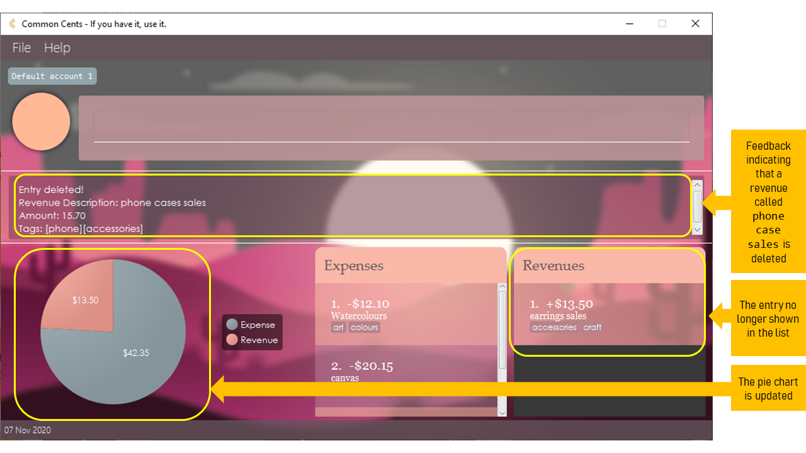
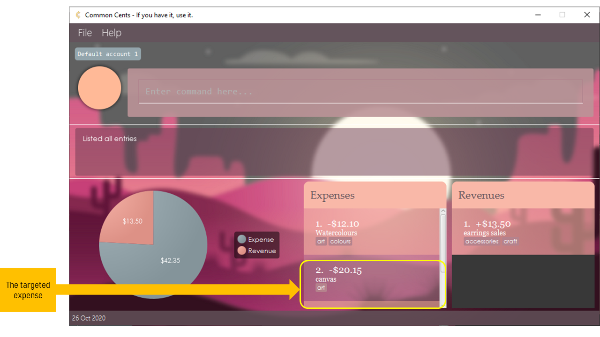
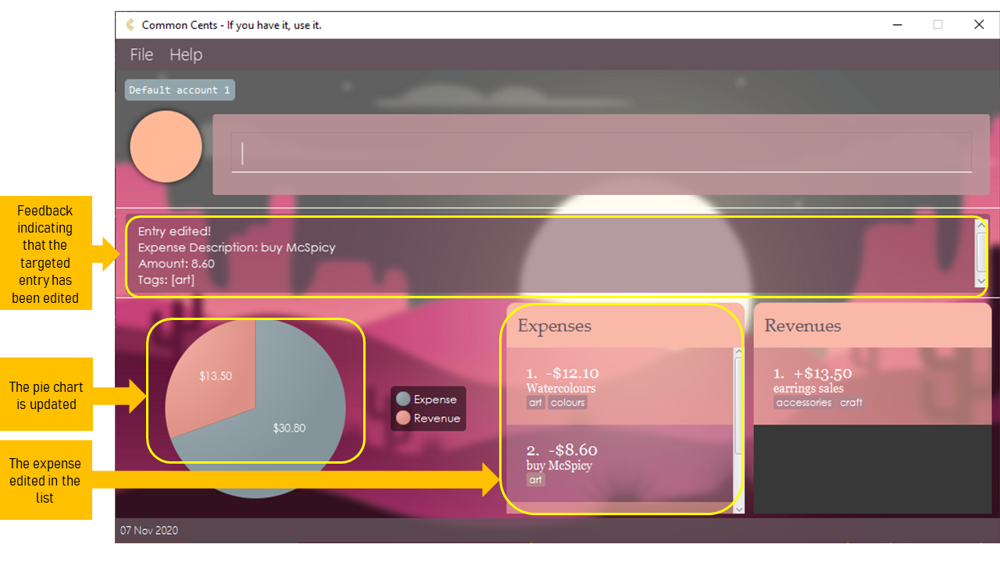
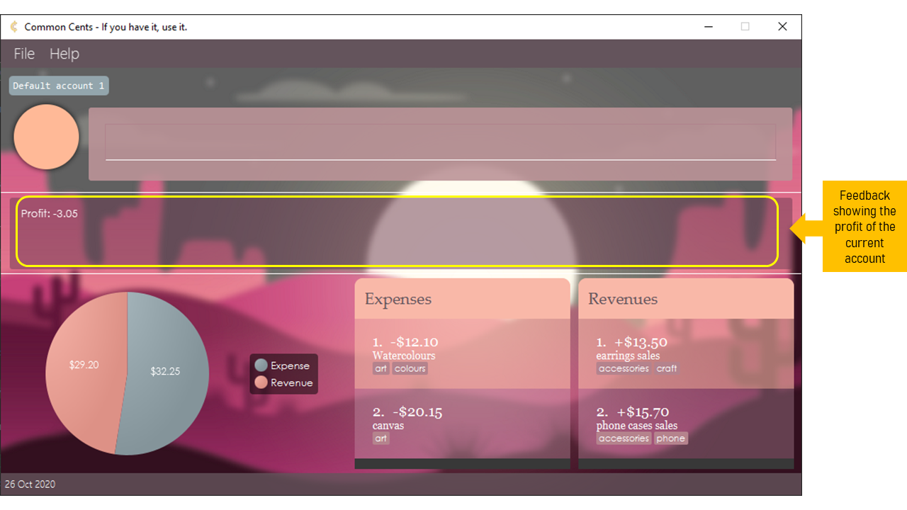
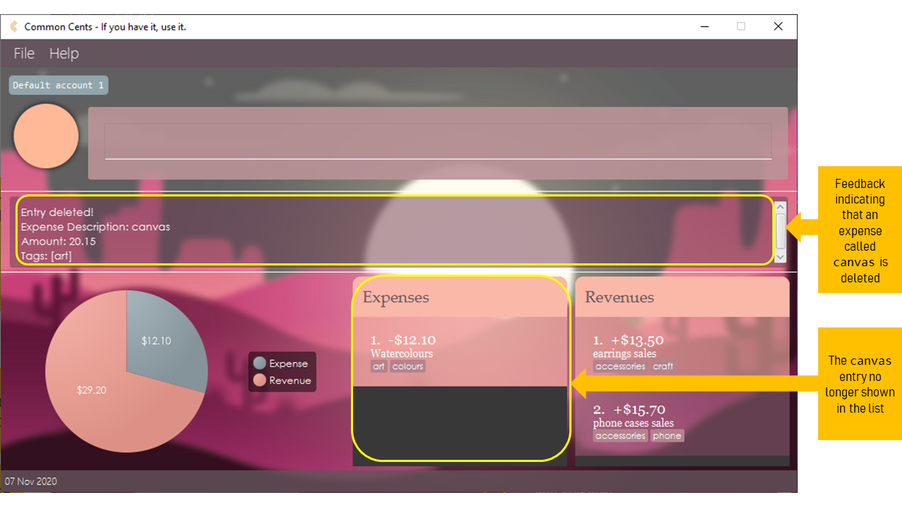
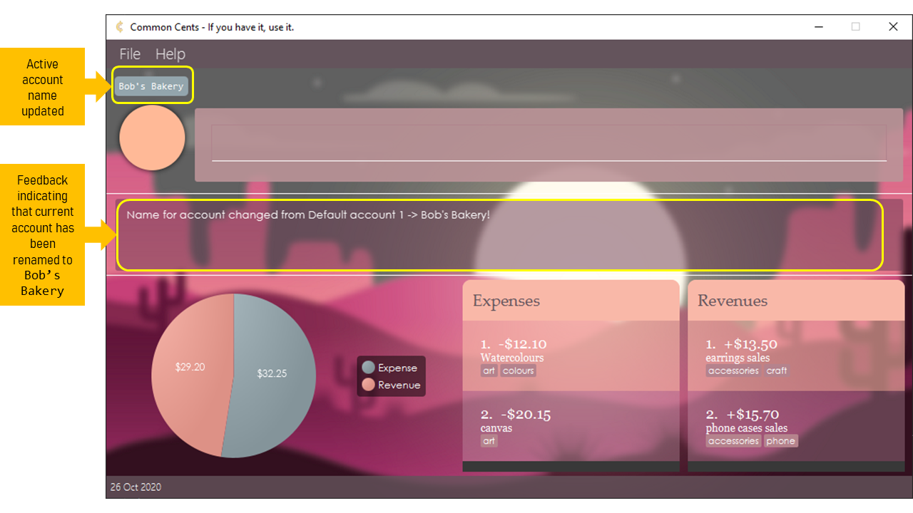

Thank you for choosing **Common Cents**! This is your convenient at-hand **expense-tracking tool**, meant for **anyone who runs a small-scale business**. 
With just a few commands, _Common Cents_ will keep track, categorise and calculate your income and expenditure for you! 
You can even keep your expenses in multiple accounts for seamless organisation. Amalgamating the features of a 
Command Line Interface (CLI) with a Graphical User Interface (GUI), _Common Cents_ is meant to be functional, intuitive and 
faster than most traditional GUI expense-trackers out there!

* Table of Contents
{:toc}

This User Guide will show you how to navigate the User Interface (UI), give you step-by-step instructions on using commands, tips and tricks on how to maximise your experience with _Common Cents_ and clarify most doubts that you may have.

The _Common Cents_ interface and commands consist of a few levels: `Application` level, `Account` level and `Entry` level. 
* `Application` level commands deal with interactions with the app itself. 
* `Account` level commands deal with managing the different accounts in the app. 
* `Entry` level commands deal with managing the entries which are either expenses or revenues in an account.

--------------------------------------------------------------------------------------------------------------------
# 1. Quick Start
Below are steps to help you set up and start your Common Cents experience!

1\. Ensure you have Java `11` or above installed in your Computer.

2\. Download the latest `commoncents.jar`.

3\. Copy the file to the folder you want to use as the _home folder_ for _Common Cents_.

4\. Double-click the file to start the app. You should see the GUI similar to the one below in a few seconds (**Figure 1-1**). 
Note how the app contains some sample expenses and revenues if you have not used the app before. 

 
 
  <b>Figure 1-1</b>: Default GUI  

5\. Type the command in the command box and press Enter to execute it. e.g. typing `help` and pressing Enter will open the help window. 
   Some example commands you can try:

   * `add c/expense d/buy lunch a/5.20 t/food` : Adds an expense named "buy lunch" to the expense list.
   * `delete 1 c/expense` : Deletes the 1st entry in the expense list.
   * `exit` : Exits the app.

6\. Refer to the [Features](#5-features) below for details of each command.

--------------------------------------------------------------------------------------------------------------------
[comment]: <> (Copy the blocks below and edit your message)
# 2. How to identify notations
These blocks are a few examples of notations that will be used in this document. Each block and icon 
has a different meaning so do look out for them under our features.

 

:information_source: **Note:** 

Important notes to read regarding the feature. 

[comment]: <> (This only appears in Github CSS)

:bulb: **Tip:**

Ways to better your experience with _Common Cents_.

:green_book: **Example:**

An example, or multiple examples to follow.

:warning: **Warning:**

Important cautions that needs to be known before using the feature.

--------------------------------------------------------------------------------------------------------------------
# 3. User Interface Overview
*(Written by Le Hue Man)*

As you can see, **figure 3-1** below shows the default user interface (UI) of _Common Cents_ with its components.  

  <b>Figure 3-1</b>: Default user interface of <i>Common Cents</i>  

You can find the description for each UI component shown in the table below.  

UI component | Description
--------|------------------
*Menu bar* | Displays the menu bar of _Common Cents_. You can use this to access the User Guide or exit the application. 
*Active account name* | Displays the account you are currently on.
*Display picture* | Displays the default display picture of the application.
*Command box* | Displays a text field for you to type the commands.
*Result display* | Displays the result of your command. If the command is invalid, an error message will be displayed to prompt and guide you to input valid correct command.
*Account summary chart* | Displays the total expenses and revenues in your current account in a pie chart.
*Chart legend* | Displays the legend for the account summary chart.
*Status bar* | Displays the current date.
*Expense list* | Displays all the expenses in your current account in a panel.
*Revenue list* | Displays all the revenues in your current account in a panel.

--------------------------------------------------------------------------------------------------------------------
# 4. Components
This section describes the various components that comprises _Common Cents_, mainly Account and Entries. If you
are new to _Common Cents_, do not fret as this section will guide you step by step in understanding the components
available! This will better your experience with _Common Cents_ and your usage of features!

## 4.1 Accounts
Accounts in Common Cents are key features that help you better manage, categorise, and organise your finances better. 
In Common Cents, each account has a unique name, and a unique list of expenses and revenues. 
You can make as many accounts as you'd like in order to help you better categorise and organise your finances better! 
 
When you first launch Common Cents, a **General Account** is made for you by default, which you may use on top of other
accounts. You may also make new accounts and switch between them and give them their very own set of expenses and revenues.

### 4.1.1 Name
As mentioned in the previous section, you are able to make new accounts on top of the General Account. Every account 
**MUST** have a unique name and duplicate names are not supported, so that you are able to distinguish and identify your
accounts better.

### 4.1.2 Expense List
Each account will have an Expense list - that is, a list of transactions that involve expenditure on your end (i.e.
net outflow of money). In general, expenses keyed into Common Cents have a compulsory Description and Amount, as well as 
optional Tags. In the app user interface, each expense amount will be displayed as a negative value and all the expenses
will be displayed as a scrollable list.

### 4.1.3 Revenue List
Each account will also have a Revenue list - that is, a list of transactions that involve profit from your end (i.e.
net inflow. of money). Like expenses, revenues keyed into Common Cents have a compulsory Description and Amount, as well as 
optional Tags. In the app user interface, each revenue amount will be displayed as a positive value and all the revenues
will be displayed as a scrollable list, right beside the expenses list.

## 4.2 Entries
'Entry' (or 'Entries') is the term used to describe either Expense or Revenue. Each entry input into Common Cents would 
have compulsory fields - Description, Amount - and optional Tags. 

### 4.2.1 Category
Category is the field that specifies the type of Entry input that Common Cents receives from you. It is used in commands
to differentiate entries between Expense and Revenue. You can either specify the category as an `expense` or a `revenue`,
or `e` or `r` for short and these are not case-sensitive. This documentation uses `expense` or `revenue` as examples in 
the [Features](#5-features) below.

### 4.2.2 Description
Description refers to the textual information that is associated with the Entry that Common Cents receives from you, in
order to provide more information about the Entry.  

### 4.2.3 Amount 
Amount is the numeric value associated with the Entry that Common Cents receives from you. All amounts, for both expenses
and revenues must be given as a positive value.

### 4.2.4 Tags
Tags refer to short textual prompts attached to an Entry, with the purpose of giving extra information and identity for
your Entries in Common Cents.

--------------------------------------------------------------------------------------------------------------------

# 5. Features
Here are some general notes about the commands in _Common Cents_ 

:information_source: **About the command format:** 

* Words in UPPERCASE are the parameters to be supplied by the user. 
  e.g. in `add c/CATEGORY...`, `CATEGORY` is a parameter which can be used as `add c/REVENUE...`

* Items in square brackets are optional. 
  e.g. `...a/AMOUNT [t/TAG]` can be used as `...a/50.10 t/Supplies` or as `...a/50.10`.

* Parameters **preceded by a prefix** can be in any order. 
  e.g. if the command specifies `c/CATEGORY d/DESCRIPTION...`, `d/DESCRIPTION c/CATEGORY...` is also acceptable.

* **Numeric** parameters (e.g. `INDEX`) must be in the correct order. 
  e.g. if the command specifies `INDEX c/CATEGORY`, only `INDEX c/CATEGORY` is acceptable 
  and `c/CATEGORY INDEX` is invalid. 
  
* Commands with no prefix parameters (e.g. `clear`, `profit`, `listacc`) can take in extra words after the command word
  without affecting its execution. 
  e.g. the command `profit abc` works the same as `profit` and is considered valid.

The commands are separated into three categories: App-Level commands, Entry-Level commands and Account-Level Commands.

Each level interacts with _Common Cents_ differently to maximise your experience. More details about each level are 
found in its own section below.  

## 5.1 App-Level Commands
App-Level commands deals with interactions with the app, _Common Cents_, itself.

### 5.1.1 Viewing help : `help`

You can use this command when you are at a lost or want to view an overview of how to use the application.
This command will return a message explaining how to access the help page (**Figure 5.1-1**). 
You can click on the `Copy URL` button to copy the link to clipboard and paste it in your web browser.   

**Format**: `help`

:green_book: **Example:**

* `help`: Returns help prompt (**Figure 5.1-1**)

  <b>Figure 5.1-1</b>: Help message  

 
### 5.1.2 Exiting the program : `exit`

You can use this command when you are done with what you need to do and want to close the application.

**Format:** `exit`
 

:green_book: **Example:**

* `exit`: Returns exit message then quits the program in 1.5 seconds (**Figure 5.1-2**)

  <b>Figure 5.1-2</b>: Exit message appears in Result display  

## 5.2 Entry-Level Commands
Entry-Level commands involve managing the entries which are either expenses or revenues in an account. 

### 5.2.1 Adding an entry: `add`

You can use this command when you want to add an entry (expense/revenue) to the tracker.

**Format:** `add c/CATEGORY d/DESCRIPTION a/AMOUNT [t/TAG]`

:green_book: **Example:**

* `add c/expense d/buying supplies a/10.10 t/blogshop t/eCommerce` (**Figure 5.2-1**)
* `add c/revenue d/sale of clothes a/200 t/blogshop t/eCommerce`

  <b>Figure 5.2-1</b>: A new expense called "buying supplies" is added  

 

:information_source: **Note:**

* Adds an entry to either category.
* The category refers to the classification of the entry in the entry lists.
* The category must be either 'expense' or 'revenue'.
* Each tag can only be 1 word.
* If multiple tags are required, do input multiple t/ prefixes.
* Each tag in entry only appears once even if added multiple times.

:bulb: **Tip:**

* Input expense/revenue information can be in any order

### 5.2.2 Deleting an entry: `delete`

You can use this command to remove an entry (expense/revenue) from the tracker when you do not want to keep track of 
it anymore.

**Format:** `delete INDEX c/CATEGORY`

:green_book: **Example:**

* `delete 1 c/expense` : Deletes first entry in expense category
* `delete 2 c/revenue` : Deletes second entry in the revenue category (**Figure 5.2-2**)

:bulb: **Tip:**

* It is possible for you to use the `find` function then `delete`.

  <b>Figure 5.2-2</b>: The revenue at index 2 is deleted  

 

:information_source: **Note:**

* Deletes the entry at the specified INDEX.
* The index refers to the index number shown in the displayed entry lists.
* The index must be a positive integer (e.g. 1, 2, 3), and must be within the range of the number of entries (e.g. if there are 10 entries, the INDEX given cannot be > 10).

### 5.2.3 Editing an entry: `edit`

You can use this to make edits to any existing entries in the tracker when the details of the entry are wrongly keyed.

**Format:**
* `edit 1 c/CATEGORY d/DESCRIPTION a/AMOUNT t/TAG`
* `edit 2 c/CATEGORY d/DESCRIPTION`
* `edit 3 c/CATEGORY a/AMOUNT`

:green_book: **Example:**

* `edit 2 c/expense d/buy McSpicy a/8.60`: Changes the name and the amount of entry 2 (**Figure 5.2-3**) to 
`buy McSpicy` and `$8.60` respectively (**Figure 5.2-4**)
* `edit 2 c/revenue d/sell McNuggets`: Changes the name of entry 2 to `sell McNuggets` 
* `edit 2 c/expense a/5.50`: Changes the amount of entry 2 to `$5.50`

  <b>Figure 5.2-3</b>: The targeted expense at index 2 before editing  

  <b>Figure 5.2-4</b>: The targeted expense at index 2 after editing  

 

:information_source: **Note:**

* Edits an entry that matches the entry name and changes the parameters of an entry depending on which are specified.
* The tags d/ and a/ have to be used to indicate which field specifies DESCRIPTION and which field specifies AMOUNT.
* When editing an entry’s tags, the existing tags of the entry will be removed i.e adding of tags is not cumulative.
* The index must be a positive integer 1, 2, 3, and must be within the range of the number of entries
(e.g. if there are 10 entries, the `INDEX` given cannot be > 10).
* It is possible for you to use the `find` function then `edit`.
* The `edit` command still executes if you use the same description, amount or tags as the existing entry in the parameters.

:warning: **Warning:**

* When you use the 'edit' command after the 'find' command, if the edited description does not match the predicate, it disappears from the list!

### 5.2.4 Locating entries by description: `find`
*(Written by Le Hue Man)*

You can use this command to list expenses and/or revenues that have the given keyword(s) in their descriptions. This is 
useful when you want to find some particular entries to [`delete`](#522-deleting-an-entry-delete) or [`edit`](#523-editing-an-entry-edit). 
If there is no expense or revenue found, the respective list will be empty.

**Format:** `find [c/CATEGORY] k/KEYWORDS`

:green_book: **Example:** 

* `find c/expense k/watercolours canvas`: Finds all expenses with keywords `watercolours` and/or `canvas` in their 
description
* `find c/revenue k/phone`: Finds all revenues with keyword `phone` in their 
description
* `find k/canvas earrings`: Finds all expenses and revenues with keywords `canvas` and/or `earrings` in their 
description (**Figure 5.2-5**)
 

 

  <b>Figure 5.2-5</b>: Find command successfully executed  

 

:information_source: **Note:**

* The search is case-insensitive. e.g. `grocery` will match `grocery` and `Grocery`.
* Only the entry's description is searched.
* The search does not match partial words. e.g. `food` will match `food` and `fast food` but not `fastfood`.
* Entries matching at least one keyword will be returned (i.e. OR search). e.g. `Food` will return `Hawker food`, 
`Restaurant Food`.
* The `c/CATEGORY` is optional.

[comment]: <> (This only appears in Github CSS)

:bulb: **Tip:** When there are a lot of entries, and you want to delete something, 
you can use `find` to search for it in the list and use [`delete INDEX`](#522-deleting-an-entry-delete) to remove it from the updated
list, with the updated `ENTRY INDEX`.

### 5.2.5 Listing all entries: `list`

You can use this command to list all entries in the current account when you want to have an overview of your account.

**Format:** `list`
 

:green_book: **Example:**

* `list`: Returns the latest list of all entries

### 5.2.6 Clearing all expenses or revenue: `clear`

You can use this command to clear all entries from a particular category when you do not need to track them anymore.
 
**Format:** `clear [c/CATEGORY]`
 

:green_book: **Example:**

* `clear`: Clears all entries visible in both the expense and revenue lists
* `clear c/expense`: Clears all entries visible in expense list (**Figure 5.2-6**)
* `clear c/revenue`: Clears all entries visible in revenue list

  <b>Figure 5.2-6</b>: The expenses in the account are cleared  

 

:information_source: **Note:**

* The `clear` command will clear all entries in the stipulated category. If you would like to delete selected
entries, use the `delete` command instead.
* It is possible for you to use the `find` function then `clear`.

### 5.2.7 Calculating net profits based on expenses and revenues: `profit` 

If you wish to calculate the profits you have currently, you may use this command to do so.
 
**Format:** `profit`
 

:green_book: **Example:**

* `profit`: Returns the profits (**Figure 5.2-7**) by taking the difference between the expenses and revenues

  <b>Figure 5.2-7</b>: Profit command successfully executed  

 

:information_source: **Note:**

The `profit` function will show deficits as a negative number if the total expenses is greater than the total revenue.

### 5.2.8 Undoing Entry-level commands: `undo`

You can use this command to return to the state of the entry prior to the previous command.

 
**Format:** `undo`
 

:green_book: **Example:**

* `undo`: Returns the state of expenses and revenues prior to the previous command. For example, if the 
[`delete`](#522-deleting-an-entry-delete) command was used (**Figure 5.2-8**), using `undo` returns account to the state before the 
[`delete`](#522-deleting-an-entry-delete) command was used (**Figure 5.2-9**).

  <b>Figure 5.2-8</b>: Before the undo command, an expense was deleted  

  <b>Figure 5.2-9</b>: After the undo command, the deleted expense is added again  

 

:information_source: **Note:**

* Do note that the `undo` command can only undo  [`add`](#521-adding-an-entry-add), [`delete`](#522-deleting-an-entry-delete),
[`edit`](#523-editing-an-entry-edit) and [`clear`](#526-clearing-all-expenses-or-revenue-clear) commands at the entry-level. 
Account-level commands cannot be reverted using the `undo` command. 
* Once you use the [`switchacc`](#535-switching-accounts-switchacc) command, all the previous states for the `undo` command will be lost. This would mean that if you choose to switch back to the account, you cannot undo the previous entry-level commands anymore.

:warning: **Warning:**

* There is no `redo` command to revert your `undo` command. Do use the `undo` command with caution!
* Once you exit the app, all the previous states will be lost. Do confirm your changes to the entries in the account 
before you exit the app!

## 5.3 Account-level Commands
Account-Level commands involve managing the different accounts in the app. 

### 5.3.1 Adding new account: `newacc`

You can create a new account to manage a different set of entries with this command. 

**Format**: `newacc n/NAME`

:green_book: **Example:**

* `newacc n/My Flower Shop`: Adds a new account, `My Flower Shop`, with no expenses or revenues
* `newacc n/$uper $avers`: Adds a new account, `$uper $avers`, with no expenses or revenues (**Figure 5.3-1**)

  <b>Figure 5.3-1</b>: A new account called $uper $avers is added  

 

:information_source: **Note:**

* The app does not automatically switch to the new account. Once the account is created, you can check it using [`listacc`](#534-listing-accounts-you-have-listacc) or switch to it using [`switchacc`](#switching-accounts-switchacc). 
* You cannot create an account with the same name as an existing account.

### 5.3.2 Deleting an account: `deleteacc`

You can remove an account by using this command. This command is useful for clearing accounts you are no longer using.

**Format:** `deleteacc INDEX`

:green_book: **Example:**

* `deleteacc 3`: Deletes third account based on list generated by using [`listacc`](#534-listing-accounts-you-have-listacc)
 (**Figure 5.3-2**)

  <b>Figure 5.3-2</b>: An account called My Flower Shop is deleted  

 

:information_source: **Note:**

Do note that _Common Cents_ prevents you from deleting the account if you are currently on that account
or if the account is your only account left.

:bulb: **Tip:**

If you are unsure of the account index, use [`listacc`](#534-listing-accounts-you-have-listacc) to check the index!

:warning: **Warning:**

Deleting your account means all the data of the entries in the account is lost as well. Also, deleting is an 
irreversible action and cannot be undone. Do delete your account with caution!

### 5.3.3 Editing the name of the current account: `editacc`

You can edit the name of the current account you are on using this command.

**Format:** `editacc n/NAME`

:green_book: **Example:**

* `editacc n/Bob's Bakery`: Replaces the name of the current account, `Default Account 1` to `Bob's Bakery` (**Figure 5.3-3**)

  <b>Figure 5.3-3</b>: The currently active account, "Default Account 1", is renamed to "Bob's Bakery"  

 

:information_source: **Note:**

* You can only edit the account name of the account you are currently on. To edit the name
of another account, you can use [`switchacc`](#535-switching-accounts-switchacc) to switch to the other account
and edit the name from there.
* You cannot edit the account name to a name of another existing account.

### 5.3.4 Listing accounts you have: `listacc`

You can check the accounts you have in the app by using this command. Each account will be numbered with an index and 
displayed as their names.

**Format:** `listacc`

:green_book: **Example:**

* `listacc`: Shows a numbered list of the account names as a message (**Figure 5.3-4**)

  <b>Figure 5.3-4</b>: All the accounts are listed in the Result Display  

### 5.3.5 Switching accounts: `switchacc`

You can use this command to switch to the desired account. This is useful if you want to manage entries in the 
desired account or edit the name of the desired account.

**Format:** `switchacc INDEX`

:green_book: **Example:**

* `switchacc 2`: Switches to the second account based on the list generated by 
[`listacc`](#534-listing-accounts-you-have-listacc) (**Figure 5.3-5**)

  <b>Figure 5.3-5</b>: Current account has been switched to "Default account 2"  

:bulb: **Tip:**

If you are unsure of the account index, use [`listacc`](#534-listing-accounts-you-have-listacc) to check the index!

:warning: **Warning:**

Once you use the `switchacc` command, all the previous states for the [`undo`](#528-undoing-entry-level-commands-undo) command will
be lost. This would mean that if you choose to switch back to the account, you cannot undo the previous entry-level
commands anymore. Do confirm the changes made to the entries in the account before you switch account!

--------------------------------------------------------------------------------------------------------------------
# 6. Frequently Asked Questions (FAQ)

This section contains a few frequently asked questions with regard to _Common Cents_.

## 6.1 General Inquiry
This section features general questions about _Common Cents_ that are not specific to the features.

1\. **Question:** How do I save my data in _Common Cents_? 

**Answer:** You do not need to do anything! Your data will be automatically saved in the `data` folder
 under the name of `CommonCents.json`.

2\. **Question:** How do I transfer my data to another computer? 

**Answer:** Install the app in the other computer and overwrite the default data file (in the `data` folder) with the file 
`(CommonCents.json)` that contains the data of your previous _Common Cents_ session.

3\. **Question:** What if I notice something wrong with the application? 

**Answer:** You may submit a bug report or send us a notice directly [here](https://github.com/AY2021S1-CS2103T-T13-4/tp).

## 6.2 Features Inquiry
This section features feature-related questions about _Common Cents_.

1\. **Question:** What happens if I forget my account names? 

**Answer:** You may use the `listacc` command to see a full list of your existing accounts.

2\. **Question:** I encountered this situation when using the features as shown in the screenshot below. I understand that the 
prefix indicated is wrong after checking the `add` section in the User Guide. However, the error message states that my category is
wrong (**Figure 6.2**). Can I clarify on this situation? 

  <b>Figure 6.2</b>: Error message that might cause confusion  
 

**Answer:** 
Yes, the prefix indicated is wrong as it should be `d/` instead of `n/`. As a result, the category parameter is read as
`expense n/buy McSpicy a/8.60` instead of `expense`. Do remember to check that the **prefixes and parameters required for a command
are correct!** If you are unsure of the prefixes and parameters required, do check the sections under features above! 

3\. **Question:** What if I typed in multiple prefixes with valid parameters? For instance, `add c/expense c/revenue d/Buy lunch a/4.30`.  

**Answer:** Multiple instances of prefixes, as well as indexes except for `tags (t/)` will not be executed and an error 
message will be shown. For instance, the example above has both `c/expense` and `c/revenue`, hence the command will not be executed. 
Please follow the format of the commands closely in the [Features](#5-features) section above!
--------------------------------------------------------------------------------------------------------------------

# 7. Command Summary
The table below summarises the above commands in the order of appearance in this User Guide for your reference. 

Action | Format
--------|------------------
[**Help**](#511-viewing-help--help) | `help`
[**Exit**](#512-exiting-the-program--exit) | `exit`
[**Add**](#521-adding-an-entry-add) | `add c/CATEGORY d/DESCRIPTION a/AMOUNT [t/TAG]`
[**Delete**](#522-deleting-an-entry-delete) | `delete INDEX c/CATEGORY`
[**Edit**](#523-editing-an-entry-edit) | `edit INDEX c/CATEGORY [d/DESCRIPTION] [a/AMOUNT] [t/TAG]`
[**Find**](#524-locating-entries-by-description-find) | `find k/KEYWORD [MORE_KEYWORDS]`
[**List**](#525-listing-all-entries-list) | `list`
[**Clear**](#526-clearing-all-expenses-or-revenue-clear) | `clear c/CATEGORY`
[**Profit**](#527-calculating-net-profits-based-on-expenses-and-revenues-profit) | `profit`
[**Undo**](#528-undoing-entry-level-commands-undo) | `undo`
[**New Account**](#531-adding-new-account-newacc) | `newacc n/NAME`
[**Delete Account**](#532-deleting-an-account-deleteacc) | `deleteacc INDEX`
[**Edit Account Name**](#533-editing-the-name-of-the-current-account-editacc) | `editacc n/NAME`
[**List Account**](#534-listing-accounts-you-have-listacc) | `listacc`
[**Switch Account**](#535-switching-accounts-switchacc) | `switchacc INDEX`

--------------------------------------------------------------------------------------------------------------------

# 8. Acknowledgement

* The project is a brown-field project, based on AddressBook-Level3 by the [SE-EDU initiative](https://se-education.org/).
* The background image is [Designed by Freepik](http://www.freepik.com). 
